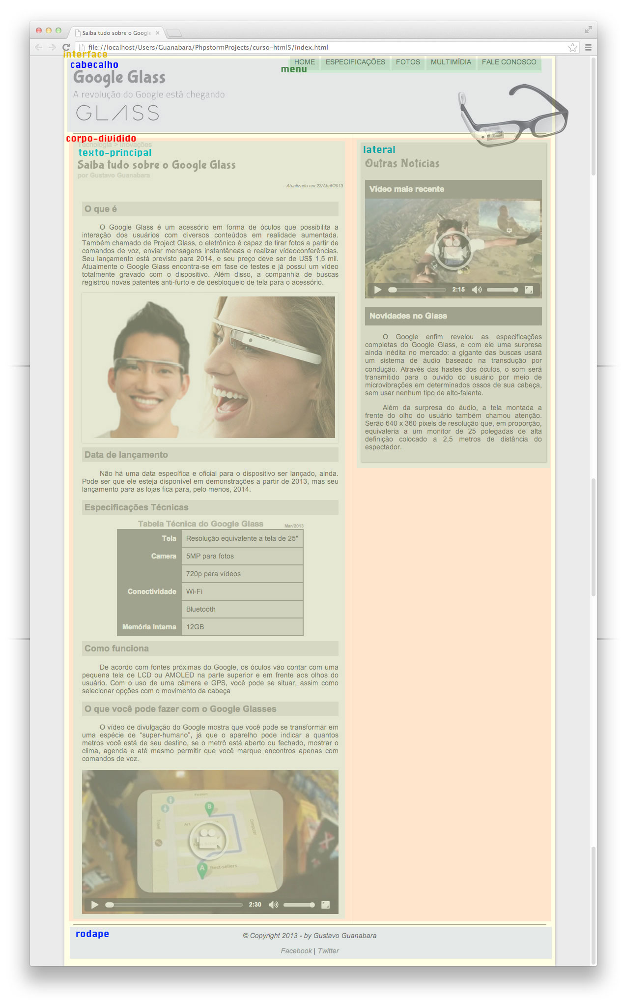

# Landing Page Google Glass
## Curso em video
### Html5 Course - Gustavo Guanabara 🔥

<p>
  
  
</p>

## About the project
 Professor Gustavo Guanabara launched a completely free HTML5 Full Course on YouTube, this is the project developed during the HTML5 course.

## Project Images

### Preview

### Divisoes Semânticas

### Menu - Especificações

### Menu - Fotos

### Menu - Multimídia

### Menu - Fale Conosco


## Technologies

- [HTML](https://developer.mozilla.org/pt-BR/docs/Web/HTML)
- [CSS](https://developer.mozilla.org/pt-BR/docs/Web/CSS)
- [javascript](https://developer.mozilla.org/pt-BR/docs/Web/JavaScript)

## ⚙️🔧 Running The Project
```bash
# Clone this repository
git clone https://github.com/jorgeeder/Curso-em-Video-HTML5

# Acess dev-finance folder
cd Curso-em-Video-HTML5

# Open the file with your browser
index.html
```

Made with 💜 by [Jorge Eder](https://github.com/jorgeeder)

<p>
  <a href="https://www.linkedin.com/in/jorgeeder/">
      
  </a>
  <a href = "mailto:jorgeeder.dev@gmail.com">
  
  </a>
</p>